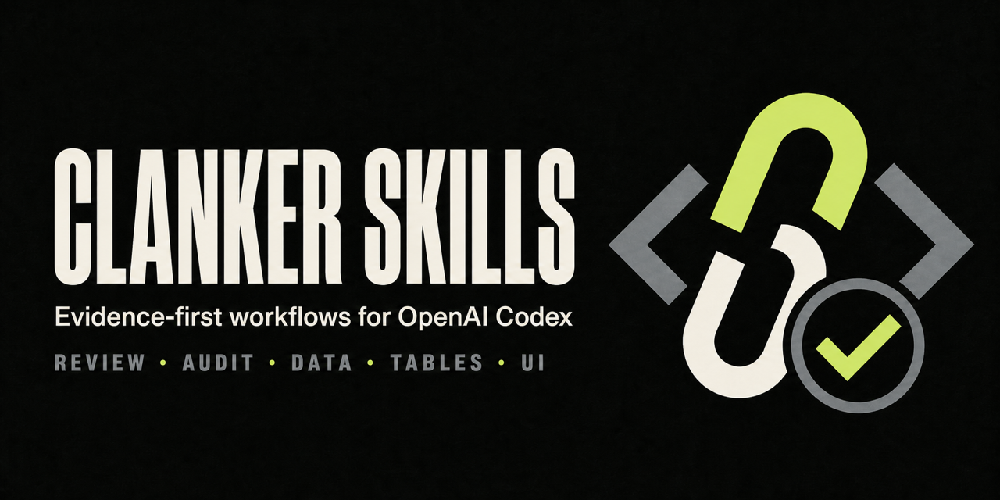

  

  <h1>Clanker Skills</h1>

  
<strong>Map reality. Change the owner. Prove the outcome.</strong>

  

    
    
    
  

Clanker Skills is a curated collection of 13 evidence-first software-engineering
workflows for Codex, Claude Code, OpenCode, Pi, and Grok Build. The same
portable skill payload is shipped in each runtime's native layout, so a
workflow retains its scripts, references, templates, assets, and licenses
wherever it is installed.

The collection is for work where a successful command is not sufficient
evidence. It helps an agent identify the owner before editing, map reachable
surfaces, validate analytical inputs, organize comparable evidence in tables,
and remove chat residue from durable prose.

> [!NOTE]
> This is a community-maintained project. It is not affiliated with or endorsed
> by OpenAI, Anthropic, OpenCode, Pi, or xAI.

## Install

Choose the runtime you use. Each package is independently usable; no symlink,
shared home-directory setup, or Codex installation is required for the other
four runtimes.

| Runtime | Native package | Primary route | Package guide |
| --- | --- | --- | --- |
| Codex | Codex plugin | Marketplace installation | [Codex](#codex) |
| Claude Code | <code>platforms/claude-code/</code> | <code>claude --plugin-dir</code> | [Claude Code](platforms/claude-code/README.md) |
| OpenCode | <code>platforms/opencode/.opencode/skills/</code> | <code>opencode.json</code> <code>skills.paths</code> | [OpenCode](platforms/opencode/README.md) |
| Pi | <code>platforms/pi/skills/</code> | <code>pi install</code> from Git | [Pi](platforms/pi/README.md) |
| Grok Build | <code>platforms/grok/.grok/skills/</code> | <code>config.toml</code> <code>[skills]</code> path | [Grok Build](platforms/grok/README.md) |

### Codex

Add the repository as a plugin marketplace, then install its plugin:

~~~bash
codex plugin marketplace add CanerKocak/clanker-skills --ref main
codex plugin add clanker-skills@clanker-skills
~~~

Start a new task after installation. A skill can activate from its description,
or invoke one directly:

~~~text
$writing-plans turn this specification into an implementation plan
$edit-the-chain map the owner and blast radius before changing this API
$analyze-data-quality determine whether this export is safe to publish
~~~

The Codex package follows the documented
[plugin structure](https://developers.openai.com/plugins/build/plugins): one
<code>.codex-plugin/plugin.json</code> manifest and one <code>skills/</code>
tree.

### Claude Code

Clone the repository and start Claude Code with the standalone plugin directory:

~~~bash
git clone https://github.com/CanerKocak/clanker-skills.git "$HOME/clanker-skills"
claude --plugin-dir "$HOME/clanker-skills/platforms/claude-code"
~~~

Run <code>/skills</code> to confirm discovery. Claude Code namespaces these
workflows as <code>/clanker-skills:writing-plans</code>,
<code>/clanker-skills:edit-the-chain</code>, and so on. See the
[Claude Code package guide](platforms/claude-code/README.md) for the native
plugin layout.

### OpenCode

Merge the native package path into <code>opencode.json</code>:

~~~json
{
  "$schema": "https://opencode.ai/config.json",
  "skills": {
    "paths": [
      "/absolute/path/to/clanker-skills/platforms/opencode/.opencode/skills"
    ]
  }
}
~~~

The [OpenCode package guide](platforms/opencode/README.md) also covers the
project-local <code>.opencode</code> copy and discovery check.

### Pi

The repository root is a Pi package. Install the native Pi skills directly
from Git:

~~~bash
pi install git:github.com/CanerKocak/clanker-skills@main
~~~

Use <code>pi install -l</code> to attach the package only to the current
project. The [Pi package guide](platforms/pi/README.md) also provides a
settings-based route for an existing clone.

### Grok Build

Add the native skills directory to the <code>[skills]</code> paths in
<code>~/.grok/config.toml</code>:

~~~toml
[skills]
paths = ["/absolute/path/to/clanker-skills/platforms/grok/.grok/skills"]
~~~

The [Grok Build package guide](platforms/grok/README.md) covers global and
project-local installation, including discovery with <code>grok inspect</code>.

## Why these workflows exist

Most failures in agent-driven engineering are not syntax failures. They come
from editing the wrong owner, missing another caller, trusting a partial
dataset, promoting a weak suspicion into a security finding, or hiding
important differences inside unstructured prose.

Clanker Skills contributes four recurring controls:

- **Ownership before edits.** Map the real oracle, call chain, and reachable
  product surfaces before changing a shared contract.
- **Independent evidence.** Reconcile compiler or language-server evidence
  with AST and text searches instead of treating one heuristic as exhaustive.
- **Structured evidence before conclusions.** Put comparable findings,
  mappings, status, and verification into tables whose rows remain tied to
  observed evidence.
- **Restraint before ceremony.** Reject speculative guards, recovery rails,
  generic UI patterns, and prose that merely narrates the work session.

## Workflow map

~~~mermaid
flowchart TD
    A[Request] --> C{Workstream}
    A -.->|multi-step specification| W[writing-plans]
    W --> C
    A -.->|uncertain or high-risk| B[adaptive-code-orchestrator]
    B --> C
    C -->|non-trivial code change| D[edit-the-chain]
    D --> E[semantic-blast-radius]
    E --> F[ast-grep-callchain-audit]
    E --> G[call-chain-invariants]
    F --> H[Smallest correct change]
    G --> H
    H -.->|security-focused diff| I[differential-review]
    H --> J[thermo-nuclear-code-quality-review]
    I -.->|guard or fallback proposed| K[yagni-anti-ceremonial]
    C -->|Data| L{Business context complete?}
    L -->|No| M[gather-business-context]
    L -->|Yes| N[analyze-data-quality]
    M --> N
    C -->|Frontend or durable prose| T[uncodixfy or prompt-leakage]
~~~

This is a routing map, not a requirement to invoke every skill. Small local
work should stay small.

## Skill catalog

### Planning and change safety

| Skill | Use it for | Core contract |
| --- | --- | --- |
| [<code>writing-plans</code>](plugins/clanker-skills/skills/writing-plans/SKILL.md) | A specification or requirements for a multi-step task, before implementation begins. | Produces an implementation-ready plan with exact files, interfaces, tests, verification commands, and no placeholder steps. |
| [<code>adaptive-code-orchestrator</code>](plugins/clanker-skills/skills/adaptive-code-orchestrator/SKILL.md) | Uncertain, cross-cutting, or high-risk repository work. | Chooses solo work, bounded reconnaissance, dependency waves, or independent review according to the evidence gap. |
| [<code>edit-the-chain</code>](plugins/clanker-skills/skills/edit-the-chain/SKILL.md) | A non-trivial edit that needs owner and impact mapping. | Classifies the requested route as a short path, awkward parkour, or the wrong oracle, then binds review to the exact final candidate. |
| [<code>semantic-blast-radius</code>](plugins/clanker-skills/skills/semantic-blast-radius/SKILL.md) | Shared APIs, types, helpers, state machines, or public contracts. | Builds one cross-file impact graph from compiler or LSP evidence plus independent AST and text searches. |
| [<code>ast-grep-callchain-audit</code>](plugins/clanker-skills/skills/ast-grep-callchain-audit/SKILL.md) | Structural definitions, calls, imports, parameter flow, and variants. | Contributes AST-backed call-chain edges and counterexamples; a structural match remains a candidate until verified. |
| [<code>call-chain-invariants</code>](plugins/clanker-skills/skills/call-chain-invariants/SKILL.md) | Similar-looking product surfaces with uncertain shared behavior. | Classifies each reachable surface as applying, different-contract, not applicable, or unknown before completeness is claimed. |
| [<code>differential-review</code>](plugins/clanker-skills/skills/differential-review/SKILL.md) | Security-focused review of a commit, branch, diff, or pull request. | Uses history, blast radius, coverage, and adversarial analysis while requiring evidence before promoting a finding. |
| [<code>yagni-anti-ceremonial</code>](plugins/clanker-skills/skills/yagni-anti-ceremonial/SKILL.md) | Proposed guards, fallbacks, compatibility rails, or recovery paths. | Separates live contract requirements from residual risk, policy, follow-up work, ceremony, and theater. |
| [<code>thermo-nuclear-code-quality-review</code>](plugins/clanker-skills/skills/thermo-nuclear-code-quality-review/SKILL.md) | The final source candidate before delivery. | Runs two distinct coherence passes: ownership and boundary integrity, then simplification and hidden-coupling pressure. |

### Data and business context

| Skill | Use it for | Core contract |
| --- | --- | --- |
| [<code>gather-business-context</code>](plugins/clanker-skills/skills/gather-business-context/SKILL.md) | Missing definitions, source authority, ownership, recent changes, or decision framing. | Retrieves only the context needed downstream, preserves source conflicts, and does not disguise retrieval as analysis. |
| [<code>analyze-data-quality</code>](plugins/clanker-skills/skills/analyze-data-quality/SKILL.md) | Tables, financial equations, dashboards, query results, or analytical evidence. | Establishes grain and checks completeness, uniqueness, validity, consistency, integrity, freshness, distributions, and reconciliation boundaries. |

### Interface and durable prose

| Skill | Use it for | Core contract |
| --- | --- | --- |
| [<code>uncodixfy</code>](plugins/clanker-skills/skills/uncodixfy/SKILL.md) | Generating or revising frontend HTML, CSS, React, Vue, Svelte, or product UI. | Avoids generic agent-generated dashboard patterns in favor of product-specific hierarchy, spacing, motion, and color. |
| [<code>prompt-leakage</code>](plugins/clanker-skills/skills/prompt-leakage/SKILL.md) | Comments, READMEs, instructions, review text, and commit messages. | Removes chat motives, restatements, and reviewer theater while retaining information that a stranger cannot infer. |

## Make routing automatic in Codex

After installing the Codex plugin, add the repository's single
[evidence-first routing block](docs/global-routing.md) to your global
<code>~/.codex/AGENTS.md</code>. It maps work by contract, including
<code>$writing-plans</code> for multi-step specifications, establishes the
table-first output contract, and makes clear when not to invoke adjacent
workflows.

## Repository structure

~~~text
.agents/plugins/marketplace.json            Codex marketplace catalog
.github/assets/social-preview.png           Repository brand card
AGENTS.md                                    Table-first output contract
plugins/clanker-skills/
├── .codex-plugin/plugin.json               Codex plugin identity and UI metadata
└── skills/<name>/                          Canonical source for all 13 skills
    ├── SKILL.md                            Trigger and workflow contract
    ├── agents/openai.yaml                  Codex display metadata
    └── references|scripts|templates|...    Package-owned resources
platforms/
├── claude-code/                            Standalone Claude Code plugin
├── opencode/.opencode/skills/              Native OpenCode skill tree
├── pi/skills/                              Native Pi skill tree
└── grok/.grok/skills/                      Native Grok Build skill tree
scripts/sync_platform_packages.py           Regenerates and checks native mirrors
scripts/validate_repository.py              Dependency-free repository validation
~~~

The canonical source is the only place to edit a portable skill. The four
platform trees are generated, self-contained copies that deliberately omit
only Codex display metadata under <code>agents/</code>.

## Verification

Run the same checks used by GitHub Actions from the repository root:

~~~bash
python3 scripts/sync_platform_packages.py --check
python3 scripts/validate_repository.py
~~~

The checks fail if a mirror drifts from the portable source, an inventory,
frontmatter name, package manifest, README catalog, routing entry, local
Markdown link, provenance pin, or the 1280×640 social-preview contract moves
without an explicit update.

## Runtime boundaries

- <code>ast-grep-callchain-audit</code> expects the maintained
  <code>ast-grep</code> binary.
- <code>edit-the-chain</code> includes an optional <code>codex exec</code>
  review helper. Non-Codex runtimes retain the workflow and must use their
  native isolated-review mechanism for that optional execution path.
- Conditional workflows can name companion skills that are not bundled here.
  Missing companions must be reported as a boundary rather than simulated.

## Provenance and licensing

<code>uncodixfy</code> retains its upstream MIT License and is recorded in
[<code>THIRD_PARTY_NOTICES.md</code>](THIRD_PARTY_NOTICES.md). The repository
does not grant a blanket license for the remaining material. Public access
alone is not permission to copy, modify, or redistribute those packages; a
repository-wide license remains a maintainer decision.

## Contributing and security

Read [<code>CONTRIBUTING.md</code>](CONTRIBUTING.md) before changing a package.
For unsafe execution or exploitable workflow behavior, follow
[<code>SECURITY.md</code>](SECURITY.md) and use private vulnerability reporting.
Use public issues for reproducible bugs and focused skill proposals.

---

Built for engineers who want agents to show their work and state where their
evidence stops.
