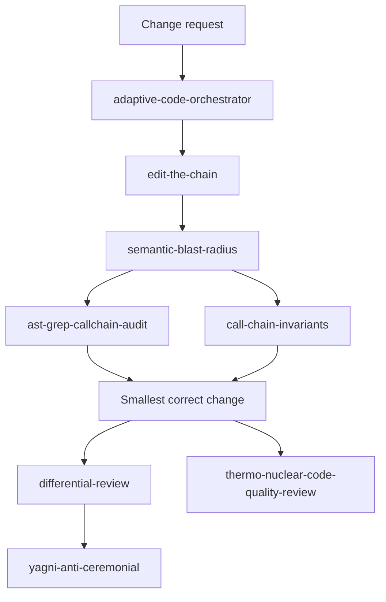

<div align="center">

# clanker-skills

**Evidence-first workflows for Codex.**

Map reality. Change the owner. Prove the outcome.

`16 skills` · `one routing layer` · `zero bundled-runtime copies`

</div>

---

This collection turns Codex into a stricter engineering partner for work where
"the command succeeded" is not enough. The skills coordinate context gathering,
impact analysis, implementation review, data-quality checks, audit publishing,
UI restraint, and the final evidence gate.

Each top-level directory is a complete skill package. Keep `SKILL.md` together
with its sibling `agents/`, `references/`, `scripts/`, `templates/`, images, and
license files.

## Workflow spine



The graph is a routing model, not a requirement to invoke every skill on every
task. Small, local work should stay small.

## Skill catalog

| Skill | Invoke it when | Contract |
|---|---|---|
| [`adaptive-code-orchestrator`](adaptive-code-orchestrator/) | Work is uncertain, cross-cutting, high-risk, or may benefit from independent evidence. | Chooses solo execution, a bounded scout, parallel reconnaissance, dependency waves, or independent review. Agent count is treated as cost, not progress. |
| [`analyze-data-quality`](analyze-data-quality/) | Structured data, financial equations, dashboard results, or analytical evidence must be trusted before use. | Establishes grain and checks completeness, uniqueness, validity, consistency, integrity, freshness, distribution shifts, and financial reconciliation boundaries. |
| [`gather-business-context`](gather-business-context/) | An analytical task is missing definitions, recent changes, source authority, ownership, or decision context. | Retrieves only the framing needed for downstream analysis, preserves source conflicts, and stops before pretending retrieval is diagnosis. |
| [`semantic-blast-radius`](semantic-blast-radius/) | A shared API, type, helper, state machine, or public contract may affect multiple files or surfaces. | Owns one canonical impact graph using compiler or LSP evidence plus independent structural and text searches. |
| [`ast-grep-callchain-audit`](ast-grep-callchain-audit/) | A review needs structural evidence for definitions, callers, callees, imports, parameters, or variants. | Contributes AST-backed edges and counterexamples to the impact graph. A structural match remains a candidate, not a verified defect. |
| [`call-chain-invariants`](call-chain-invariants/) | Similar-looking product surfaces may or may not share the same invariant. | Classifies reachable surfaces as applying, different-contract, not applicable, or unknown before anyone claims cross-surface completeness. |
| [`edit-the-chain`](edit-the-chain/) | A non-trivial edit needs owner/oracle mapping, blast-radius control, or post-change review convergence. | Labels the requested route as short path, parkour, or wrong oracle; freezes the exact candidate and binds review evidence to it. |
| [`differential-review`](differential-review/) | A commit, branch, or pull request needs security-focused review against its baseline. | Uses history, blast radius, test coverage, adversarial analysis, and a finding-promotion gate without turning policy or partial evidence into vulnerabilities. |
| [`yagni-anti-ceremonial`](yagni-anti-ceremonial/) | Someone proposes a guard, fallback, compatibility rail, recovery path, or speculative symmetry. | Classifies the proposal as live, residual, policy, not applicable, follow-up, ceremonial, theater, or partial before code is added. |
| [`thermo-nuclear-code-quality-review`](thermo-nuclear-code-quality-review/) | Source changes are ready to be called complete, pushed, or opened as a pull request. | Runs two distinct reviews on the final fingerprint: ownership/boundary coherence, then counterfactual simplification and hidden coupling. |
| [`prompt-leakage`](prompt-leakage/) | Comments, READMEs, durable instructions, or commit text are being written or reviewed. | Removes chat motives, restatements, and reviewer theater while preserving information a stranger cannot recover from the code. |
| [`pdf-findings-schema`](pdf-findings-schema/) | Security-review findings need to be frozen before report generation. | Defines the canonical JSON source of truth so the rendering layer cannot invent findings, evidence, or severity. |
| [`pdf-security-audit-report`](pdf-security-audit-report/) | Frozen findings must become a professional security assessment booklet. | Renders the report structure from frozen data, preserves severity honesty, and requires visual QA before delivery. |
| [`pdf-typst-report`](pdf-typst-report/) | A long technical or security report benefits from Typst's stable typesetting. | Provides the Typst path and template, falls back to the external `pdf` base skill when appropriate, and hands the result to visual QA. |
| [`pdf-visual-qa`](pdf-visual-qa/) | Any generated PDF is approaching delivery. | Renders pages to pixels and fails clipped, overlapping, low-contrast, overflowing, or otherwise broken layouts. |
| [`uncodixfy`](uncodixfy/) | Codex is generating or revising frontend UI. | Rejects generic AI-dashboard aesthetics and favors restrained, product-specific layout, hierarchy, spacing, motion, and color choices. |

## Install

```bash
git clone https://github.com/CanerKocak/clanker-skills.git "${HOME}/clanker-skills"
mkdir -p "${HOME}/.codex/skills"

repo_dir="${HOME}/clanker-skills"
for skill_dir in "${repo_dir}"/*; do
  [ -f "${skill_dir}/SKILL.md" ] || continue
  destination="${HOME}/.codex/skills/$(basename "${skill_dir}")"
  if [ -e "${destination}" ] || [ -L "${destination}" ]; then
    printf 'skip %s (already exists)\n' "${destination}"
    continue
  fi
  ln -s "${skill_dir}" "${destination}"
done
```

The installer loop is deliberately non-destructive: existing skill paths are
reported and left untouched.

## Global routing

Add this single section to the global `~/.codex/AGENTS.md` so Codex selects
workflows consistently:

```markdown
## Evidence-first skill routing

Select the smallest installed workflow that matches the task and read its
`SKILL.md` before acting. Use `$adaptive-code-orchestrator` for uncertain,
cross-cutting, or high-risk work. For non-trivial code changes,
`$edit-the-chain` owns the change workflow, `$semantic-blast-radius` owns the
impact graph, `$ast-grep-callchain-audit` contributes structural edges, and
`$call-chain-invariants` classifies applicable product surfaces; use
`$differential-review` for security-focused diffs, gate proposed guards and
fallbacks with `$yagni-anti-ceremonial`, and finish source changes with both
passes of `$thermo-nuclear-code-quality-review`. When analysis lacks business
framing, run `$gather-business-context` before `$analyze-data-quality`. Build
security reports from frozen `$pdf-findings-schema` data with
`$pdf-security-audit-report`, use `$pdf-typst-report` when Typst is the selected
engine, and always finish generated PDFs with `$pdf-visual-qa`. Apply
`$uncodixfy` to frontend UI work and `$prompt-leakage` to comments, READMEs,
durable instructions, and commit text. Do not invoke adjacent skills
ceremonially.
```

## Dependencies and boundaries

- `ast-grep-callchain-audit` expects the non-deprecated `ast-grep` binary.
- The PDF reporting path expects the separately installed `pdf` base skill for
  ReportLab operations; Typst is optional.
- `edit-the-chain` can run its bundled review harness through `codex exec`.
- Some conditional workflows name companion skills that are not vendored here.
  If one is unavailable, report that boundary instead of inventing its output.
- `uncodixfy` retains its upstream license in its package directory. The
  collection does not declare a blanket license for the other packages.

## Repository rule

Package assets are part of the skill contract. A change is incomplete if it
updates `SKILL.md` but leaves a referenced script, template, or evidence file
behind.
