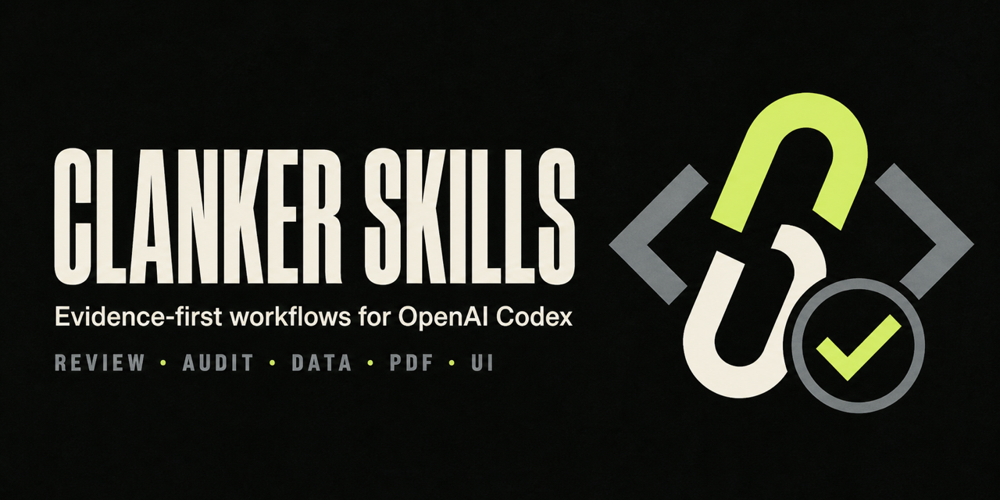

  

  <h1>Clanker Skills</h1>

  
<strong>Map reality. Change the owner. Prove the outcome.</strong>

  

    
    
    
  

Clanker Skills is a curated collection of 17 evidence-first software-engineering
workflows for Codex. One plugin contains the skills and their scripts,
references, templates, assets, and licenses.

The collection is for work where a successful command is not sufficient
evidence. It helps an agent identify the owner before editing, map reachable
surfaces, validate analytical inputs, organize comparable evidence in tables,
and remove chat residue from durable prose.

> [!NOTE]
> This is a community-maintained project. It is not affiliated with or endorsed
> by OpenAI.

## Install

Add the repository as a plugin marketplace, then install its plugin:

~~~bash
codex plugin marketplace add CanerKocak/clanker-skills --ref main
codex plugin add clanker-skills@clanker-skills
~~~

Start a new Codex session after installation. A skill can activate from its
description, or invoke one directly:

~~~text
$writing-plans turn this specification into an implementation plan
$edit-the-chain map the owner and blast radius before changing this API
$analyze-data-quality determine whether this export is safe to publish
~~~

The Codex package follows the documented
[plugin structure](https://developers.openai.com/plugins/build/plugins): one
<code>.codex-plugin/plugin.json</code> manifest and one <code>skills/</code>
tree.

## Update

Refresh the marketplace and install the plugin version from the repository:

~~~bash
codex plugin marketplace upgrade clanker-skills
codex plugin add clanker-skills@clanker-skills
codex plugin list --marketplace clanker-skills
~~~

Start a new Codex session to load the installed version. Keep plugin skills
in the plugin; copying them into `~/.codex/skills` or `~/.agents/skills`
creates a separate installation that can drift.

## Why these workflows exist

Most failures in agent-driven engineering are not syntax failures. They come
from editing the wrong owner, missing another caller, trusting a partial
dataset, promoting a weak suspicion into a security finding, or hiding
important differences inside unstructured prose.

Clanker Skills contributes four recurring controls:

- **Ownership before edits.** Map the real oracle, call chain, and reachable
  product surfaces before changing a shared contract.
- **Independent evidence.** Reconcile compiler or language-server evidence
  with AST and text searches instead of treating one heuristic as exhaustive.
- **Structured evidence before conclusions.** Put comparable findings,
  mappings, status, and verification into tables whose rows remain tied to
  observed evidence.
- **Restraint before ceremony.** Reject speculative guards, recovery rails,
  generic UI patterns, and prose that merely narrates the work session.

## Workflow map

~~~mermaid
flowchart TD
    A[Request] --> C{Workstream}
    A -.->|multi-step specification| W[writing-plans]
    W --> C
    A -.->|uncertain or high-risk| B[adaptive-code-orchestrator]
    B --> C
    C -->|non-trivial code change| D[edit-the-chain]
    D --> E[semantic-blast-radius]
    E --> F[ast-grep-callchain-audit]
    E --> G[call-chain-invariants]
    F --> H[Smallest correct change]
    G --> H
    H -.->|security-focused diff| I[differential-review]
    H --> J[thermo-nuclear-code-quality-review]
    I -.->|guard or fallback proposed| K[yagni-anti-ceremonial]
    C -->|Data| L{Business context complete?}
    L -->|No| M[gather-business-context]
    L -->|Yes| N[analyze-data-quality]
    M --> N
    C -->|Frontend or durable prose| T[uncodixfy or prompt-leakage]
~~~

This is a routing map, not a requirement to invoke every skill. Small local
work should stay small.

## Skill catalog

### Planning and change safety

| Skill | Use it for | Core contract |
| --- | --- | --- |
| [<code>writing-plans</code>](plugins/clanker-skills/skills/writing-plans/SKILL.md) | A specification or requirements for a multi-step task, before implementation begins. | Produces an implementation-ready plan with exact files, interfaces, tests, verification commands, and no placeholder steps. |
| [<code>adaptive-code-orchestrator</code>](plugins/clanker-skills/skills/adaptive-code-orchestrator/SKILL.md) | Uncertain, cross-cutting, or high-risk repository work. | Chooses solo work, bounded reconnaissance, dependency waves, or independent review according to the evidence gap. |
| [<code>edit-the-chain</code>](plugins/clanker-skills/skills/edit-the-chain/SKILL.md) | A non-trivial edit that needs owner and impact mapping. | Classifies the requested route as a short path, awkward parkour, or the wrong oracle, then binds review to the exact final candidate. |
| [<code>semantic-blast-radius</code>](plugins/clanker-skills/skills/semantic-blast-radius/SKILL.md) | Shared APIs, types, helpers, state machines, or public contracts. | Builds one cross-file impact graph from compiler or LSP evidence plus independent AST and text searches. |
| [<code>ast-grep-callchain-audit</code>](plugins/clanker-skills/skills/ast-grep-callchain-audit/SKILL.md) | Structural definitions, calls, imports, parameter flow, and variants. | Contributes AST-backed call-chain edges and counterexamples; a structural match remains a candidate until verified. |
| [<code>call-chain-invariants</code>](plugins/clanker-skills/skills/call-chain-invariants/SKILL.md) | Similar-looking product surfaces with uncertain shared behavior. | Classifies each reachable surface as applying, different-contract, not applicable, or unknown before completeness is claimed. |
| [<code>codebase-search</code>](plugins/clanker-skills/skills/codebase-search/SKILL.md) | Implementation searches, call-chain traces, and source-backed code questions. | Runs a read-only Codex search when delegation is permitted and checks decisive citations against the requested checkout. |
| [<code>git-hygiene</code>](plugins/clanker-skills/skills/git-hygiene/SKILL.md) | Commits, branches, history rewrites, issues, and pull requests. | Keeps history and review prose human-readable: plain words, one idea per unit, no host names in durable text. |
| [<code>issue-and-pr</code>](plugins/clanker-skills/skills/issue-and-pr/SKILL.md) | Creating or rewriting an issue or pull request. | Writes each as a plain-words engineering task with tables for comparable evidence, no template sections, evidence a stranger can open. |
| [<code>differential-review</code>](plugins/clanker-skills/skills/differential-review/SKILL.md) | Security-focused review of a commit, branch, diff, or pull request. | Uses history, blast radius, coverage, and adversarial analysis while requiring evidence before promoting a finding. |
| [<code>yagni-anti-ceremonial</code>](plugins/clanker-skills/skills/yagni-anti-ceremonial/SKILL.md) | Proposed guards, fallbacks, compatibility rails, or recovery paths. | Separates live contract requirements from residual risk, policy, follow-up work, ceremony, and theater. |
| [<code>thermo-nuclear-code-quality-review</code>](plugins/clanker-skills/skills/thermo-nuclear-code-quality-review/SKILL.md) | The final source candidate before delivery. | Runs two distinct coherence passes: ownership and boundary integrity, then simplification and hidden-coupling pressure. |

### Data and business context

| Skill | Use it for | Core contract |
| --- | --- | --- |
| [<code>gather-business-context</code>](plugins/clanker-skills/skills/gather-business-context/SKILL.md) | Missing definitions, source authority, ownership, recent changes, or decision framing. | Retrieves only the context needed downstream, preserves source conflicts, and does not disguise retrieval as analysis. |
| [<code>analyze-data-quality</code>](plugins/clanker-skills/skills/analyze-data-quality/SKILL.md) | Tables, financial equations, dashboards, query results, or analytical evidence. | Establishes grain and checks completeness, uniqueness, validity, consistency, integrity, freshness, distributions, and reconciliation boundaries. |

### Interface and durable prose

| Skill | Use it for | Core contract |
| --- | --- | --- |
| [<code>uncodixfy</code>](plugins/clanker-skills/skills/uncodixfy/SKILL.md) | Generating or revising frontend HTML, CSS, React, Vue, Svelte, or product UI. | Avoids generic agent-generated dashboard patterns in favor of product-specific hierarchy, spacing, motion, and color. |
| [<code>prompt-leakage</code>](plugins/clanker-skills/skills/prompt-leakage/SKILL.md) | Comments, READMEs, instructions, review text, and commit messages. | Removes chat motives, restatements, and reviewer theater while retaining information that a stranger cannot infer. |
| [<code>simple-english</code>](plugins/clanker-skills/skills/simple-english/SKILL.md) | Technical documentation, procedures, runbooks, error messages, and API guides. | Uses aircraft-manual clarity while preserving facts, uncertainty, and obligations; checks strict STE rules when requested. |

## Make routing automatic

The [routing block](docs/global-routing.md) provides an optional addition to
`~/.codex/AGENTS.md`. It selects skills by task, preserves continuity when
runtime tools are available, and distinguishes settings from execution evidence.
Keep it consistent with your existing global instructions.

## Repository structure

~~~text
.agents/plugins/marketplace.json            Codex marketplace catalog
.github/assets/social-preview.png           Repository brand card
AGENTS.md                                    Table-first output contract
plugins/clanker-skills/
├── .codex-plugin/plugin.json               Codex plugin identity and UI metadata
└── skills/<name>/                          Canonical source for all 17 skills
    ├── SKILL.md                            Trigger and workflow contract
    ├── agents/openai.yaml                  Codex display metadata
    └── references|scripts|templates|...    Package-owned resources
scripts/validate_repository.py              Dependency-free repository validation
~~~

Edit skills in `plugins/clanker-skills/skills/`. The marketplace installs
this package directly from the repository.

## Verification

Run the check used by GitHub Actions from the repository root:

~~~bash
python3 scripts/validate_repository.py
~~~

The validator checks skill inventory, frontmatter, display metadata, plugin
and marketplace manifests, catalog entries, routing entries, local links,
upstream provenance, and the 1280×640 social preview.

## Runtime boundaries

- <code>ast-grep-callchain-audit</code> expects the maintained
  <code>ast-grep</code> binary.
- <code>edit-the-chain</code> includes an optional <code>codex exec</code>
  review helper. Its use remains subject to the active delegation instructions.
- Conditional workflows can name companion skills that are not bundled here.
  Missing companions must be reported as a boundary rather than simulated.

## Provenance and licensing

<code>uncodixfy</code> retains its upstream MIT License and is recorded in
[<code>THIRD_PARTY_NOTICES.md</code>](THIRD_PARTY_NOTICES.md). The repository
does not grant a blanket license for the remaining material. Public access
alone is not permission to copy, modify, or redistribute those packages; a
repository-wide license remains a maintainer decision.

## Contributing and security

Read [<code>CONTRIBUTING.md</code>](CONTRIBUTING.md) before changing a package.
For unsafe execution or exploitable workflow behavior, follow
[<code>SECURITY.md</code>](SECURITY.md) and use private vulnerability reporting.
Use public issues for reproducible bugs and focused skill proposals.

---

Built for engineers who want agents to show their work and state where their
evidence stops.
